# AJD - Aproximate Joint Diagonalization

## Repository Description

This Julia package implements two algorithms for approximate joint diagonalization. This repo is part of course work for computer science at masters level at TU Berlin.

### ffdiag - Fast Frobenius Diagonalization

Andreas Ziehe, Pavel Laskov, Guido Nolte, and Klaus-Robert Müller. A fast algorithm for joint diagonalization with non-orthogonal transformations and its application to blind source separation. The Journal of Machine Learning Research, 5:777–800, 2004.

Paper URL: https://www.jmlr.org/papers/volume5/ziehe04a/ziehe04a.pdf

### QDiag - Fast frobenius Diagonalization

Roland Vollgraf and Klaus Obermayer. Quadratic optimization for simultaneous matrix diagonalization. IEEE Trans. Signal Process., 54(9):3270–3278, 2006. (DOI: 10.1109/TSP.2006.877673)

Paper URL: https://www.researchgate.net/publication/3319827_Quadratic_optimization_for_simultaneous_matrix_diagonalization

## How to install

### Through Julia.Pkg

To install this Julia package using Julia's package manager, follow these steps:

1. Open a terminal or command prompt.
2. Navigate to the directory where you want to install the package.
3. Run the command `julia` to start the Julia REPL.
4. In the Julia REPL, enter the package manager by pressing `]`.
5. Run `add AJD` to add the package and its dependencies.
6. Exit the package manager by pressing `Ctrl + C`.
7. You can now use the package by importing it in your Julia code.

For more detailed instructions, you can refer to the [official documentation](https://erdenay16.github.io/AJD.jl/stable/).

[](https://erdenay16.github.io/AJD.jl/stable/)
[](https://erdenay16.github.io/AJD.jl/dev/)
[](https://github.com/erdenay16/AJD.jl/actions/workflows/CI.yml?query=branch%3Amain)
[](https://codecov.io/gh/erdenay16/AJD.jl)

### Cloning from Git

To install this Julia package, you can use the following steps:

1. Open a terminal or command prompt.
2. Navigate to the directory where you want to install the package.
3. Run the command `git clone https://github.com/erdenay16/AJD.jl.git` to clone the repository.
4. Change into the cloned directory by running `cd AJD.jl`.
5. Start Julia by typing `julia` in the terminal.
6. In the Julia REPL, enter the package manager by pressing `]`.
7. Run `activate .` to activate the package environment.
8. Run `instantiate` to install the package and its dependencies.
9. Exit the package manager by pressing `Ctrl + C`.
10. You can now use the package by importing it in your Julia code.

For more detailed instructions, you can refer to the [official documentation](https://erdenay16.github.io/AJD.jl/stable/).

## Example 

### ffdiag
```Julia 
c0 = zeros(2, 2, 2) #

c0[:, :, 1] = [1.0 0.2; 0.2 0.8] #Diagonal Matrix
c0[:, :, 2] = [0.5 0.3; 0.3 0.5] #Diagonal Matrix

C, V, errs = ffdiag(c0) 
```

The output of `ffdiag`:

```Julia
C = [0.7129098004138166 -5.551115123125783e-17;  #c0[:, :, 1]
     0.0                 1.0354978428982857;;;

     0.20201378693464273 2.7755575615628914e-17; #c0[:, :, 2]
     5.551115123125783e-17 0.7693237926831918]

V = [0.7468844481936993 -0.6649538488093691; 
     0.528907590114557   0.848679421878021]
```


__C__ is the diagonalized matrices of __C0__. Note that the off-diagonal values approach 0

__V__ is the transformation matrix that diagonalized the matrices in __C__

__err__ is returned so that it can be ploted. This can be ignored for most users. 


### QDiag
#### KN3 Approach
##### Example 1: randomly created 10 4x4 fully diagonalizable matrices.
<div style="display: flex; justify-content: space-between;">
    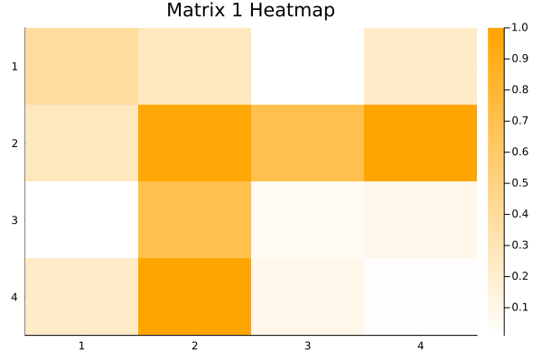
    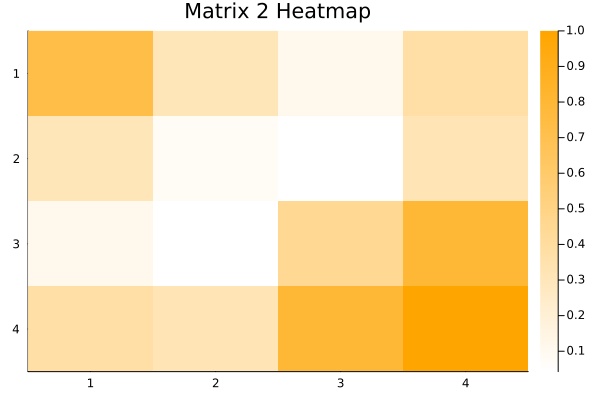
    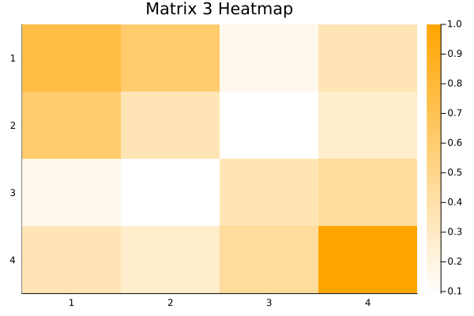
    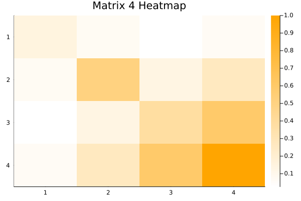
    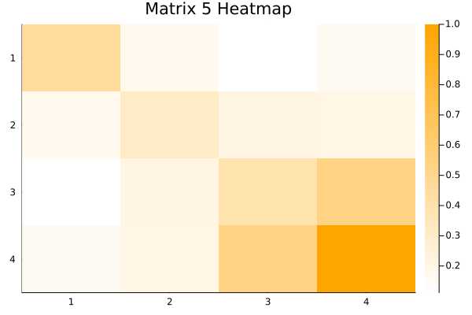
</div>

<div style="display: flex; justify-content: space-between;">
    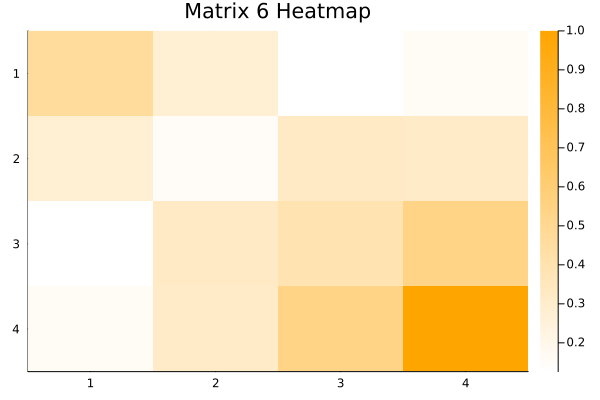
    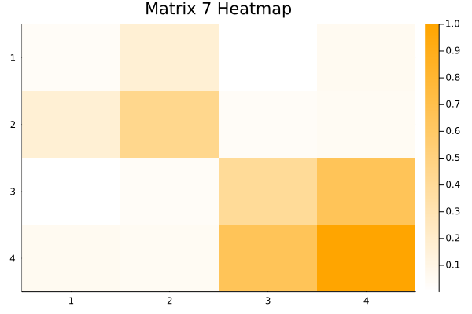
    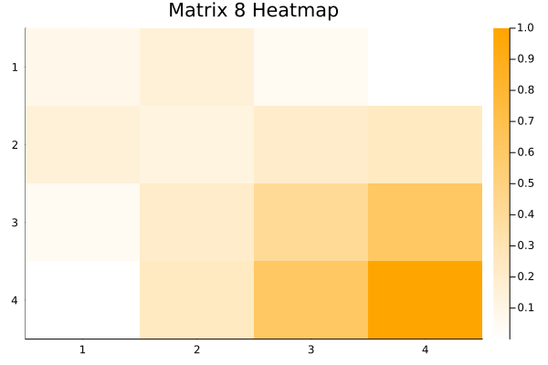
    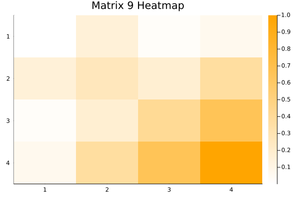
    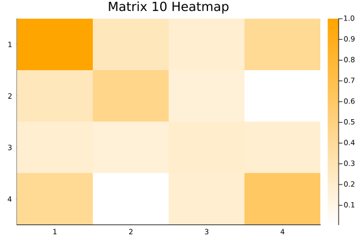
</div>

And the result of KN3 approach is:
<div style="display: flex; justify-content: space-between;">
    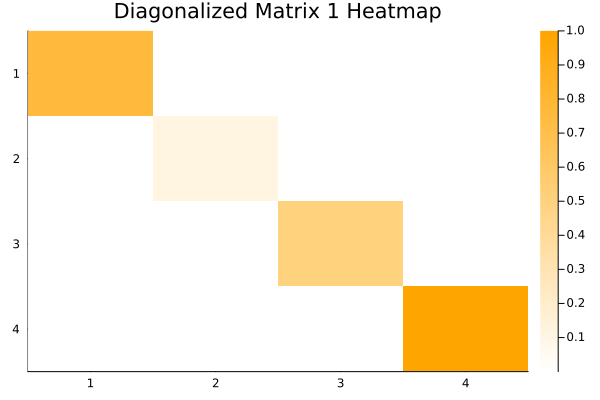
    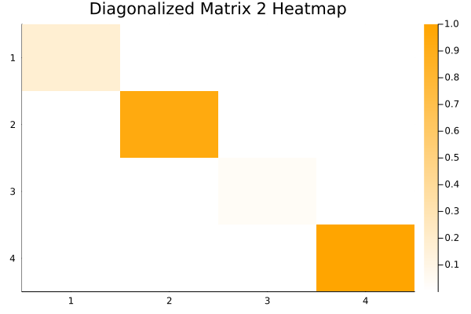
    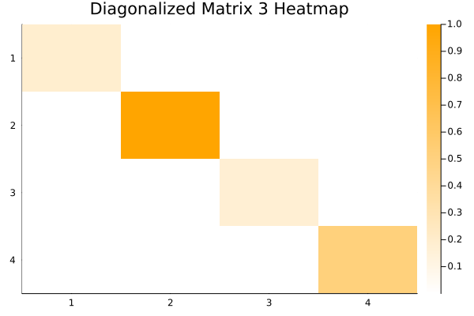
    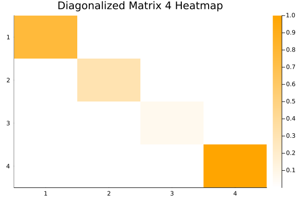
    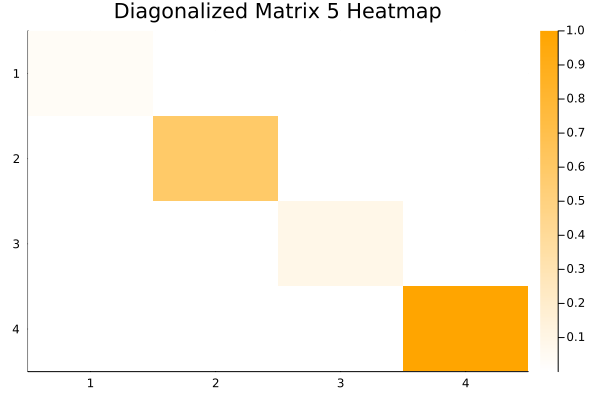
</div>

<div style="display: flex; justify-content: space-between;">
    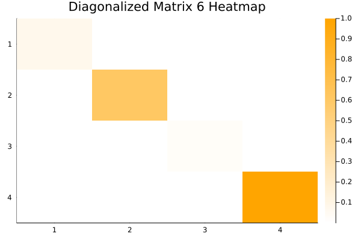
    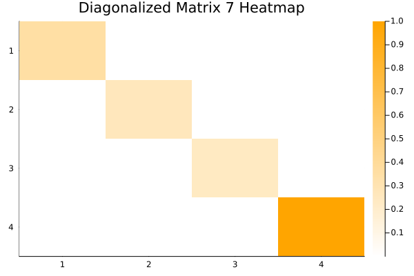
    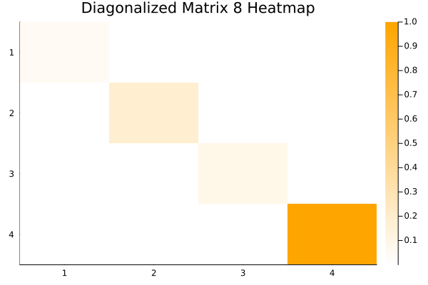
    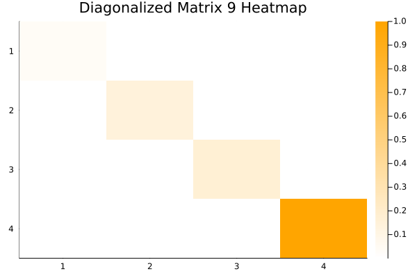
    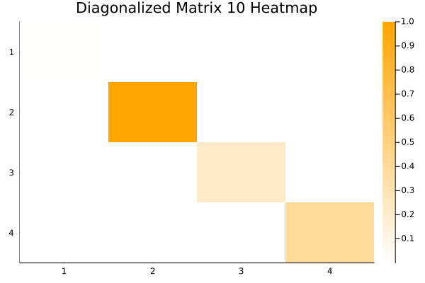
</div>


##### Example 2: randomly created 10 4x4 approximately diagonalizable matrices.

<div style="display: flex; justify-content: space-between;">
    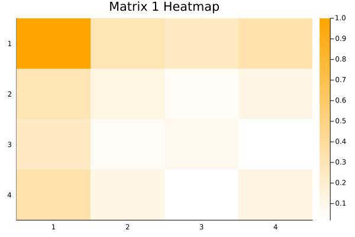
    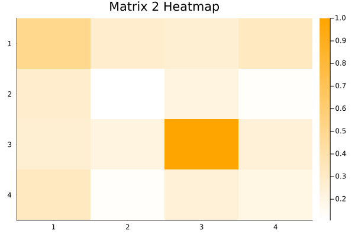
    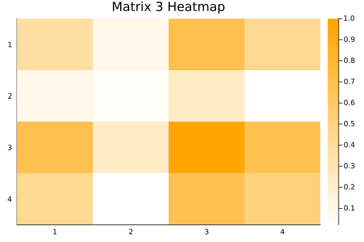
    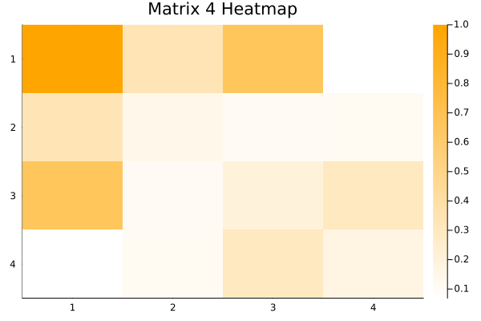
    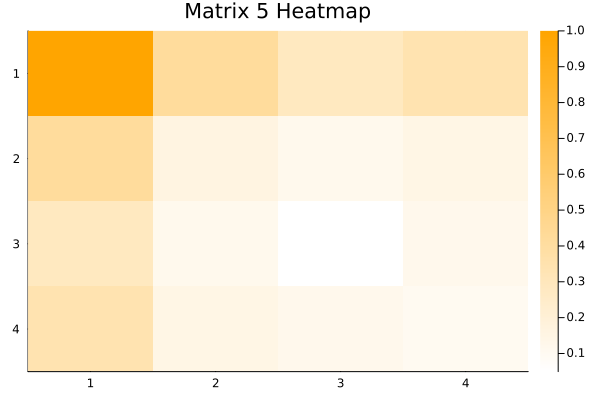
</div>

<div style="display: flex; justify-content: space-between;">
    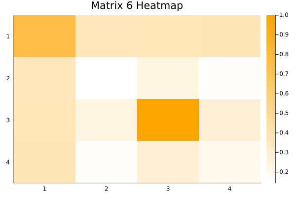
    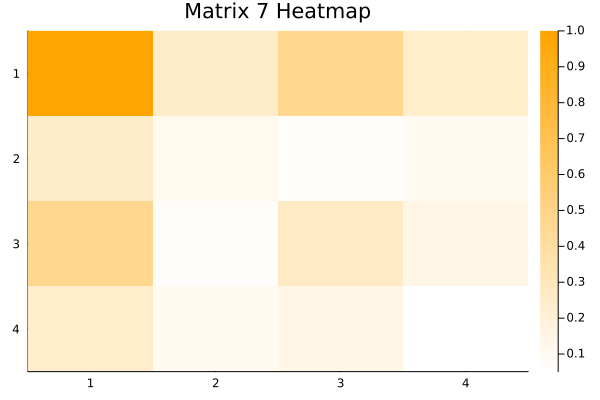
    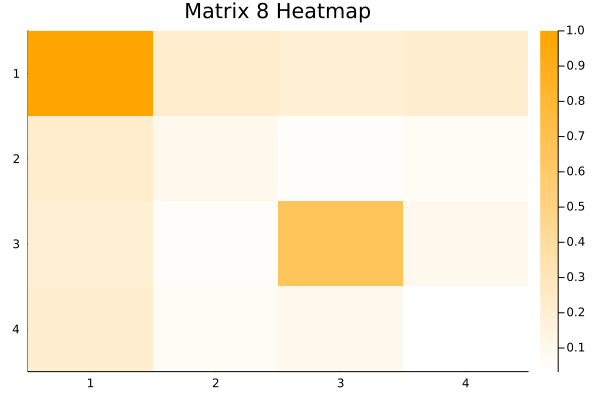
    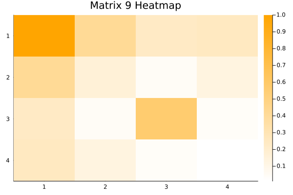
    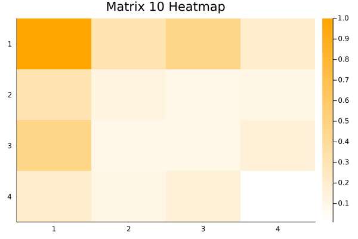
</div>

And the result of KN3 approach is:
<div style="display: flex; justify-content: space-between;">
    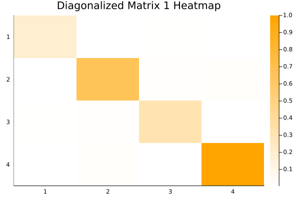
    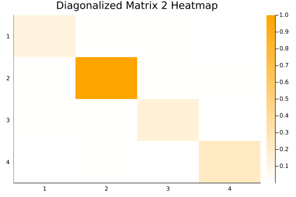
    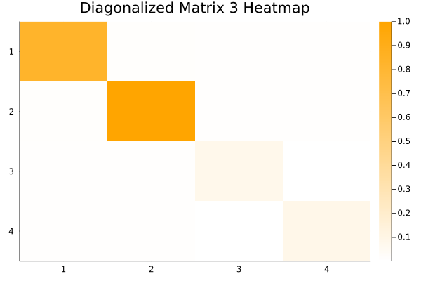
    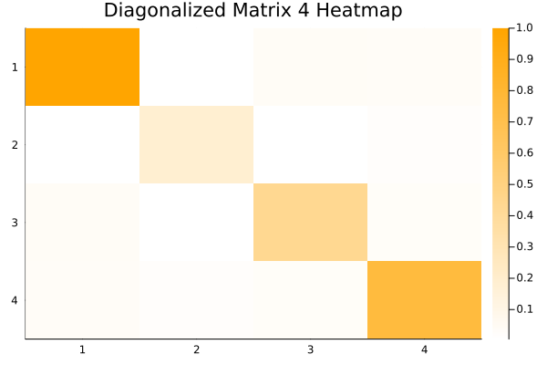
    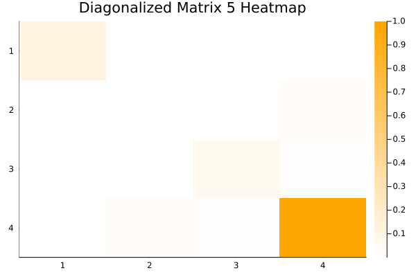
</div>

<div style="display: flex; justify-content: space-between;">
    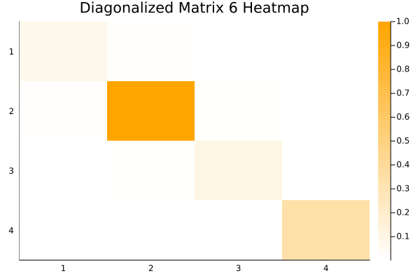
    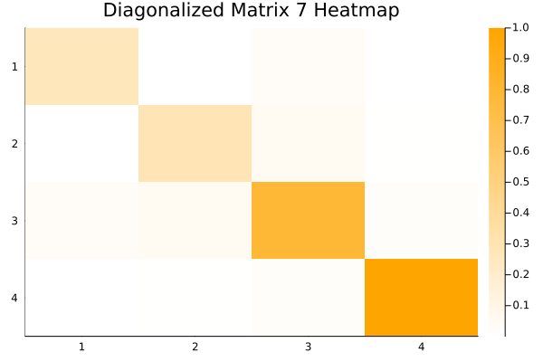
    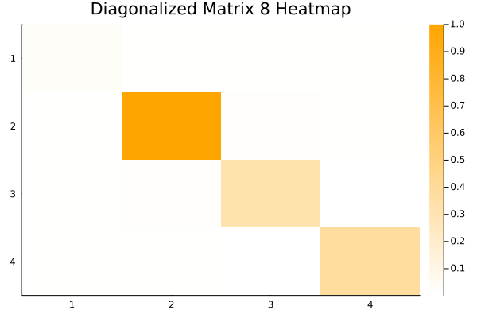
    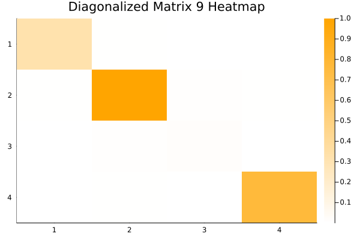
    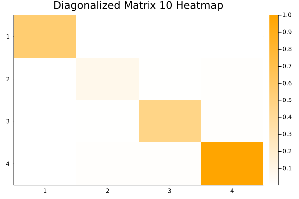
</div>
## Licence 

This package is licensed under the MIT License. You can find the full text of the license in the [LICENSE](https://github.com/erdenay16/AJD.jl/blob/main/LICENSE) file.


